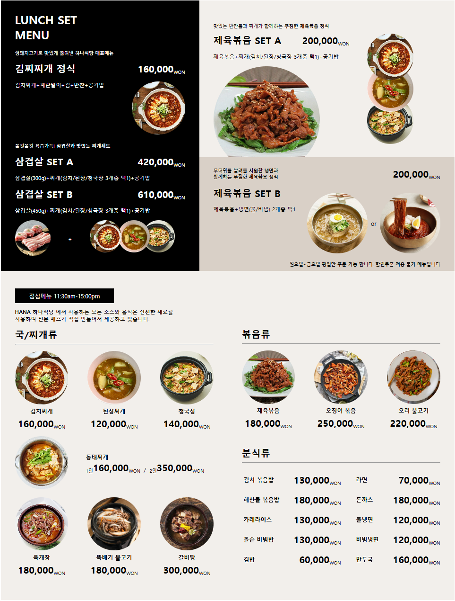

# 📋MenuBoard Page

> **목차**
> 1. [프로젝트 기술 스택 및 개발 환경](#프로젝트-기술-스택-및-개발-환경)
> 2. [소개](#소개)
> 3. [주요 기능](#주요-기능)

 

## 🔍프로젝트 기술 스택 및 개발 환경
### 🛠️ 기술 스택

### 💻 개발 환경
 

 

## 📝소개

Html과 CSS로만 구현한 간단한 음식 메뉴판입니다.

 

## 💎주요 기능 
**:one:메뉴판 상세로 이동** 
 
- 메뉴판의 음식 사진 클릭시 해당 음식의 상세페이지로 이동
  

**:two:메뉴판 반응형** 
 
- 크기가 작아짐에 따라 요소들 재배치 
